# 데이터 모델 ERD

`migrations/` 에서 세운 스키마를 [mermerd](https://github.com/KarnerTh/mermerd) 로 그린 것이다.
**손으로 고치지 않는다** — `npm run docs:erd` 가 다시 만든다.

실거래 DB 가 아니라 마이그레이션을 전부 적용한 임시 DB 를 그린다. 사용자가 앱을
안 열었으면 실거래 DB 는 아직 옛 스키마라, 그것을 그리면 코드보다 오래된 ERD 가
커밋된다.

감사 로그 계열(`audit_log`, `_audit_context`)과 `schema_migrations` 는 뺐다.
모든 표를 참조하는 부속 표라 선을 그으면 그림이 읽히지 않는다.

컬럼 설명의 `{NOT_NULL}` 은 NOT NULL 제약이다.

```mermaid
erDiagram
    app_settings {
        TEXT key PK 
        TEXT value 
    }

    card_benefits {
        TEXT benefit_type "{NOT_NULL}"
        INTEGER card_product_id FK "{NOT_NULL}"
        INTEGER category_id FK 
        TEXT created_at 
        INTEGER id PK 
        TEXT memo 
        TEXT merchant_pattern 
        INTEGER min_amount 
        INTEGER monthly_cap 
        REAL rate "{NOT_NULL}"
    }

    card_installment_policies {
        REAL annual_rate "{NOT_NULL}"
        INTEGER category_id FK 
        TEXT created_at 
        TEXT effective_from "{NOT_NULL}"
        TEXT effective_to 
        INTEGER free_from_sequence "{NOT_NULL}"
        INTEGER id PK 
        TEXT memo 
        INTEGER months "{NOT_NULL}"
        INTEGER payment_method_id FK "{NOT_NULL}"
        TEXT policy_type "{NOT_NULL}"
    }

    card_products {
        INTEGER annual_fee 
        INTEGER billing_cycle_day 
        TEXT card_type "{NOT_NULL}"
        TEXT created_at 
        INTEGER id PK 
        INTEGER is_active "{NOT_NULL}"
        TEXT issuer "{NOT_NULL}"
        TEXT memo 
        INTEGER payment_method_id FK "{NOT_NULL}"
        INTEGER prev_month_threshold 
        TEXT product_name "{NOT_NULL}"
        INTEGER statement_close_day 
    }

    categories {
        INTEGER id PK 
        INTEGER is_active 
        TEXT major_type UK "{NOT_NULL}"
        INTEGER monthly_budget 
        TEXT name UK "{NOT_NULL}"
    }

    debt_interest_log {
        INTEGER balance_after "{NOT_NULL}"
        INTEGER balance_before "{NOT_NULL}"
        TEXT created_at 
        INTEGER debt_id FK "{NOT_NULL}"
        INTEGER id PK 
        INTEGER interest_amount "{NOT_NULL}"
        TEXT log_date "{NOT_NULL}"
        TEXT memo 
        REAL rate_at_time "{NOT_NULL}"
    }

    debt_rate_history {
        REAL annual_rate "{NOT_NULL}"
        TEXT created_at 
        INTEGER debt_id FK "{NOT_NULL}"
        TEXT effective_from "{NOT_NULL}"
        TEXT effective_to 
        INTEGER id PK 
        TEXT memo 
    }

    debt_repayments {
        INTEGER amount "{NOT_NULL}"
        INTEGER balance_after "{NOT_NULL}"
        INTEGER balance_before "{NOT_NULL}"
        TEXT created_at 
        INTEGER debt_id FK "{NOT_NULL}"
        INTEGER id PK 
        INTEGER interest_portion "{NOT_NULL}"
        TEXT memo 
        INTEGER principal_portion "{NOT_NULL}"
        TEXT repaid_on "{NOT_NULL}"
    }

    debts {
        REAL annual_rate 
        INTEGER balance "{NOT_NULL}"
        INTEGER compounds 
        INTEGER credit_limit 
        INTEGER id PK 
        TEXT interest_basis 
        INTEGER interest_day 
        TEXT loan_type "{NOT_NULL}"
        TEXT memo 
        TEXT name "{NOT_NULL}"
        TEXT type 
        TEXT updated_at 
    }

    installment_duplicate_dismissals {
        TEXT dismissed_at 
        INTEGER transaction_id PK,FK 
    }

    installments {
        INTEGER category_id FK 
        INTEGER fee_per_month 
        INTEGER id PK 
        TEXT merchant "{NOT_NULL}"
        INTEGER monthly_amount "{NOT_NULL}"
        INTEGER months "{NOT_NULL}"
        TEXT paid_off_on 
        INTEGER payment_method_id FK 
        TEXT purchase_date "{NOT_NULL}"
        TEXT start_billing_month "{NOT_NULL}"
        TEXT status "{NOT_NULL}"
        INTEGER total_amount "{NOT_NULL}"
    }

    merchant_category_map {
        INTEGER category_id FK 
        TEXT confidence 
        INTEGER id PK 
        TEXT kakao_category_group 
        TEXT kakao_category_name 
        TEXT looked_up_at 
        TEXT merchant UK "{NOT_NULL}"
        TEXT source "{NOT_NULL}"
    }

    payment_methods {
        TEXT created_at 
        INTEGER id PK 
        INTEGER is_active 
        TEXT name UK "{NOT_NULL}"
        TEXT type "{NOT_NULL}"
    }

    recurrence_suggestion_dismissals {
        TEXT dismissed_at 
        INTEGER id PK 
        TEXT merchant UK "{NOT_NULL}"
    }

    recurring_occurrences {
        TEXT created_at 
        INTEGER id PK 
        TEXT occurred_on "{NOT_NULL}"
        INTEGER rule_id FK "{NOT_NULL}"
        TEXT status "{NOT_NULL}"
        INTEGER transaction_id FK 
    }

    recurring_rule_months {
        TEXT created_at 
        INTEGER id PK 
        INTEGER rule_id FK,UK "{NOT_NULL}"
        TEXT status "{NOT_NULL}"
        INTEGER transaction_id FK 
        TEXT year_month UK "{NOT_NULL}"
    }

    recurring_rules {
        INTEGER amount "{NOT_NULL}"
        INTEGER category_id FK "{NOT_NULL}"
        TEXT created_at 
        INTEGER day_of_month "{NOT_NULL}"
        TEXT ends_on 
        TEXT freq "{NOT_NULL}"
        INTEGER id PK 
        INTEGER interval "{NOT_NULL}"
        INTEGER is_active 
        TEXT last_run_on 
        TEXT memo 
        TEXT merchant "{NOT_NULL}"
        INTEGER month_of_year 
        INTEGER payment_method_id FK 
        TEXT payment_style "{NOT_NULL}"
        TEXT starts_on 
    }

    revolving_history {
        INTEGER carried_balance 
        INTEGER id PK 
        INTEGER interest 
        TEXT month "{NOT_NULL}"
        INTEGER new_charge 
        INTEGER next_carried_balance 
        INTEGER paid_amount 
        INTEGER payment_method_id FK 
    }

    savings_products {
        INTEGER category_id FK 
        INTEGER expected_payout 
        INTEGER id PK 
        TEXT maturity_date 
        INTEGER monthly_contribution "{NOT_NULL}"
        TEXT name "{NOT_NULL}"
        TEXT start_date "{NOT_NULL}"
        TEXT status 
    }

    transactions {
        INTEGER amount "{NOT_NULL}"
        TEXT approval_number 
        INTEGER card_product_id FK 
        INTEGER category_id FK "{NOT_NULL}"
        TEXT created_at 
        TEXT date "{NOT_NULL}"
        INTEGER id PK 
        INTEGER installment_id FK 
        TEXT memo 
        TEXT merchant 
        TEXT origin "{NOT_NULL}"
        INTEGER origin_ref_id 
        TEXT origin_ref_table 
        INTEGER origin_seq 
        INTEGER origin_seq_total 
        INTEGER payment_method_id FK 
        TEXT payment_style "{NOT_NULL}"
    }

    card_benefits }o--|| card_products : "card_product_id"
    card_benefits }o--|| categories : "category_id"
    card_installment_policies }o--|| categories : "category_id"
    card_installment_policies }o--|| payment_methods : "payment_method_id"
    card_products }o--|| payment_methods : "payment_method_id"
    transactions }o--|| card_products : "card_product_id"
    installments }o--|| categories : "category_id"
    merchant_category_map }o--|| categories : "category_id"
    recurring_rules }o--|| categories : "category_id"
    savings_products }o--|| categories : "category_id"
    transactions }o--|| categories : "category_id"
    debt_interest_log }o--|| debts : "debt_id"
    debt_rate_history }o--|| debts : "debt_id"
    debt_repayments }o--|| debts : "debt_id"
    installment_duplicate_dismissals |o--|| transactions : "transaction_id"
    installments }o--|| payment_methods : "payment_method_id"
    transactions }o--|| installments : "installment_id"
    recurring_rules }o--|| payment_methods : "payment_method_id"
    revolving_history }o--|| payment_methods : "payment_method_id"
    transactions }o--|| payment_methods : "payment_method_id"
    recurring_occurrences }o--|| recurring_rules : "rule_id"
    recurring_occurrences }o--|| transactions : "transaction_id"
    recurring_rule_months }o--|| recurring_rules : "rule_id"
    recurring_rule_months }o--|| transactions : "transaction_id"
```

<!-- schema-fingerprint: db56f88898aec1c5 -->

