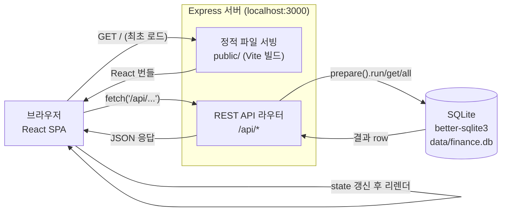

# 시스템 아키텍처 흐름

브라우저 → Express → SQLite로 이어지는 단일 프로세스 구조. 상세 스택은 `ARCHITECTURE.md` 참고.

## 참고
- 인증 없음, 단일 사용자, 로컬 전용
- API 라우터: `transactions`, `categories`, `paymentMethods`, `installments`, `revolving`, `debts`
- DB는 파일 하나(WAL 모드) — 백업은 파일 복사로 충분
