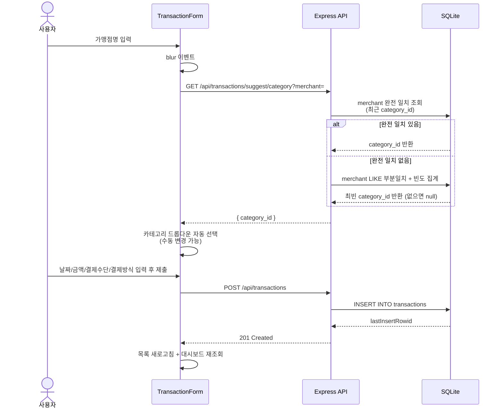

# 거래 입력 흐름 (카테고리 자동제안 포함)

가맹점명 입력 후 blur 시 카테고리를 자동 제안하고, 사용자가 확정한 뒤 저장하는 흐름.

## 참고
- 결제방식이 `할부` 또는 `리볼빙`인 경우 이 흐름을 타지 않고 각각 `installments` / `revolving_history` 테이블로 별도 등록됨 → [03-double-counting-prevention](./03-double-counting-prevention.md)
