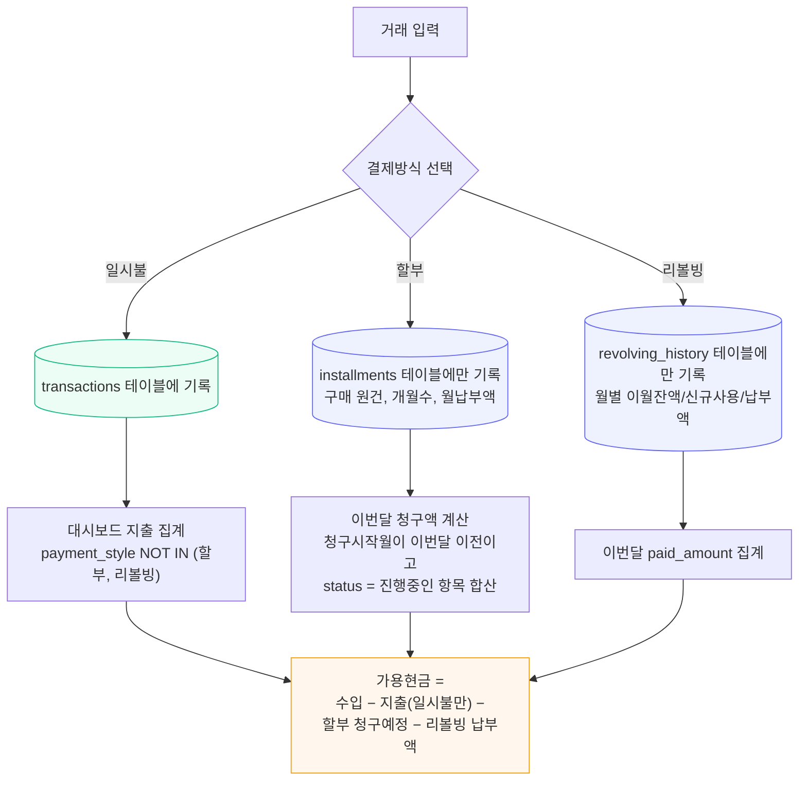

# 이중계산 방지 로직 흐름 (할부·리볼빙 분리)

할부·리볼빙 결제는 `transactions` 테이블에 절대 기록하지 않고, 전용 테이블에만 기록해 지출 통계와 분리한다. 상세 설계는 `PHASE2_DESIGN.md` §1 참고.

## 왜 분리하는가
`transactions`에 할부·리볼빙 납부를 중복 기록하면, 구매 시점 지출 + 월별 납부 지출이 이중으로 잡혀 실제보다 지출이 부풀려진다. 대시보드는 `installments`/`revolving_history`를 별도 쿼리로 조회해 "이번달 청구 예정" 항목만 가용현금 계산에 반영한다.
