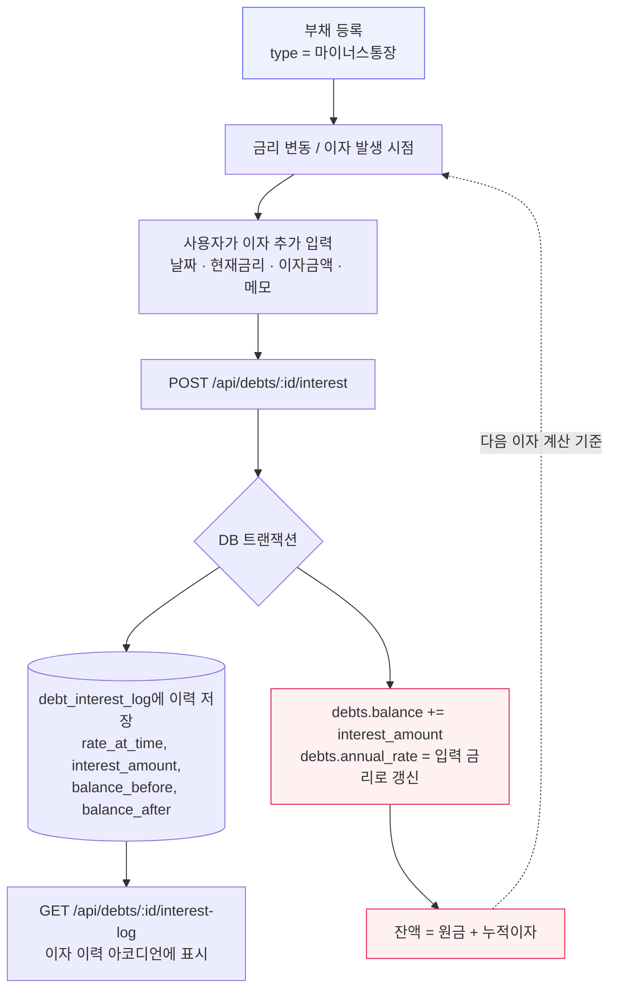

# 마이너스통장 이자 자가증식 흐름

마이너스통장은 금리가 수시로 바뀌고, 발생한 이자가 원금에 가산되어 다음 이자 계산의 기준이 되는 자가증식 구조다.

## 핵심 포인트
- 이자 금액은 사용자가 직접 입력(은행 계산과 별개로 실측값을 기록) — 앱이 자동 계산하지 않음
- `balance_before` / `balance_after`를 함께 저장해 이력 추적 가능
- 부채 삭제 시 `debt_interest_log`도 함께 cascade 삭제 (FK 제약 위반 방지)
