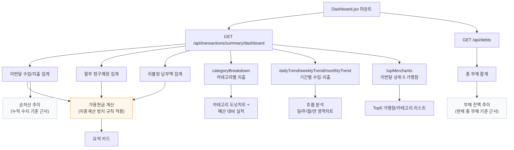

# 대시보드 데이터 집계 흐름

`Dashboard.jsx` 마운트 시 두 엔드포인트를 병렬 호출하고, 하나의 대시보드 응답 안에서 여러 집계 쿼리가 실행된다.

## 근사치 처리 안내
점선으로 표시된 두 항목은 실제 과거 스냅샷 데이터가 없어 근사 계산된다:
- **순자산 추이**: 자산−부채 절대값이 아닌 월별 수입−지출 누적합
- **부채 잔액 추이**: 과거 잔액 이력이 없어 현재 총 부채를 x축 전체에 평평하게 표시

정확한 시계열이 필요하면 잔액 스냅샷 테이블을 별도로 추가해야 한다.
